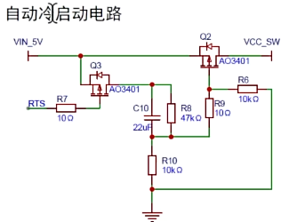

# pcd
Alt+W  画线
Alt+V  画点

## 飞线
工程设计 -> 网络 -> 飞线

## GND
工程设计 -> 网络 -> GND

## 铺铜
1. 顶层 -> 铺铜 -> 网络选择 GND
2. 边框 -> 矩形 -> 框出铺铜区域
3. 重新铺铜

## 泪滴
工具 -> 泪滴 -> 全部应用

## 顶层
1. 画线 Alt+W
2. 过孔：Ctrl+Shift+滚轮 切换层

## 底层
同顶层，通过过孔换层后画线

## 顶层丝印
1. 顶层丝印层
2. 工具 -> 字符 -> 批量调整位置
3. 画丝印边框、位号、极性标识

## 插入图片
1. 顶部菜单 -> 放置 -> 图片
2. 选择PNG/JPG图片
3. 调整位置和大小
4. 可在丝印层放置Logo或标识

## USB 母座
micro USB 母座

## DRC检查
工程 -> 检查DRC -> 运行

## 导出Gerber
1. 工程 -> 导出 -> Gerber
2. 选择输出目录
3. 导出后检查各层

## 测量距离
Alt+M 测量模式

## 布线
1. 布线时按 Tab 键可切换线宽
2. 布线模式下按 L 键可改变布线角度（45度/任意角）

## 扇出网络标签
1. 选中芯片 -> 右键 -> 扇出
2. 或 工程 -> 扇出网络标签
3. 自动从引脚引出过孔和走线
4. 适用于SMT贴片前的预处理

# 如何查看数据手册
1. 功能简述
2. 电气特性
3. 功能描述
4. 外观与封装

# 复位按钮的实现原理

## 下拉电阻方式
- RST引脚接VCC
- RST引脚通过10kΩ电阻下拉到GND
- 按钮按下时，RST直接接地，产生复位信号
- 电阻作用：防止按钮按下时VCC与GND短路

## 上拉电阻方式
- RST引脚通过电阻上拉到VCC
- RST引脚通过按钮连接到GND
- 按钮按下时，RST接地，产生复位信号

## 上拉/下拉电阻强度
- 强上拉/下拉：1kΩ - 10kΩ，阻值越小，拉动感越强
- 弱上拉/下拉：10kΩ - 100kΩ，可更高
- 常见阻值：10kΩ

# 单片机输出方式

## 推挽输出
- 内部有两个MOS管（PMOS+NMOS）
- 输出高电平时PMOS导通，低电平时NMOS导通
- 既能拉电流也能灌电流，驱动能力强
- 可直接驱动LED、继电器等负载
- 高电平接近VCC，低电平接近GND

## 开漏输出
- 只有NMOS管，无PMOS管
- 输出低电平时NMOS导通，高电平时处于高阻态
- 不能直接输出高电平，需要外接上拉电阻
- 高电平由上拉电阻提供，接近VCC
- 适合用于I2C、SPI等总线，支持线与操作
- 可实现电平转换（通过改变上拉电压）

# 晶振
## 无源晶振
- 2/4个引脚（无电源引脚）
- 需要外接匹配电容
- 精度较低，成本低
- 走线：晶振尽量靠近IC，走线要短

## 有源晶振
- 4个引脚（VCC/GND/OUT/NC）
- 内置电路，无需匹配电容
- 精度高，稳定性好
- 走线：输出端走线要短，可串电阻减少干扰

## 晶振布线注意事项
1. 晶振下方避免走其他信号线
2. 晶振周围加接地包地
3. 匹配电容靠近晶振放置

# 51单片机冷启动

## 原因
- 上电时VCC上升速度过快，CPU内部电路未稳定
- RST引脚复位信号持续时间不足
- 晶振未起振或起振不稳定
- 电源纹波过大，导致复位引脚误触发

## 解决
- 延长复位信号低电平时间，确保CPU完成复位
- 增加RC延时电路，让电源稳定后再启动
- 确保晶振匹配电容正确，加速起振
- 增加电源去耦电容，减少纹波干扰

## 冷启动电路
- RST引脚通过10kΩ电阻上拉到VCC
- RST引脚通过10μF电容接地
- RC时间常数约为100ms，确保复位信号持续足够时间
- 上电时电容充电，RST引脚保持低电平一段时间
- 电容充满后RST变为高电平，CPU开始运行

# 布线
1. 电源线要宽, 电源过孔要大
2. 信号线需要使用差分线, 避免使用单线